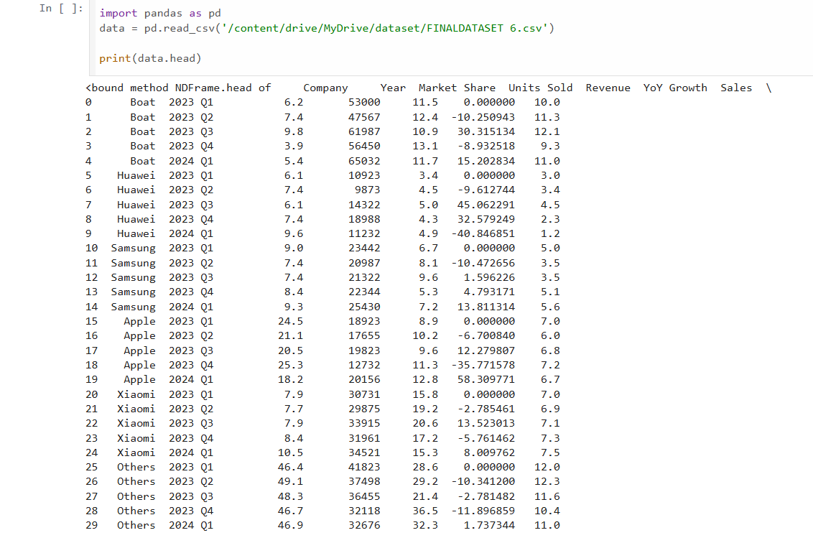
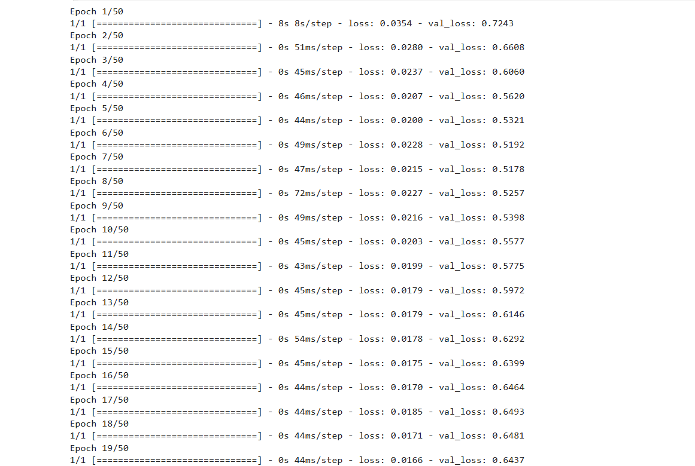
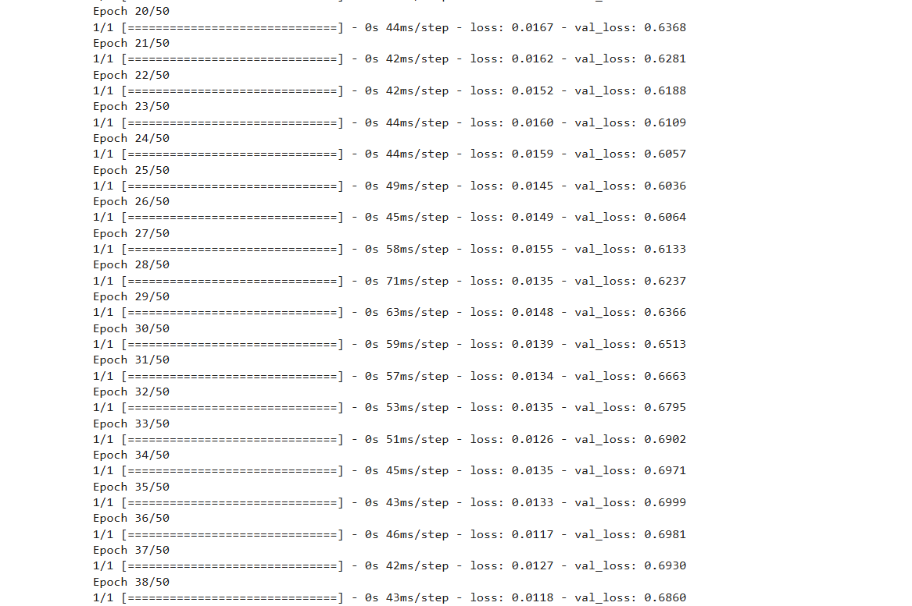
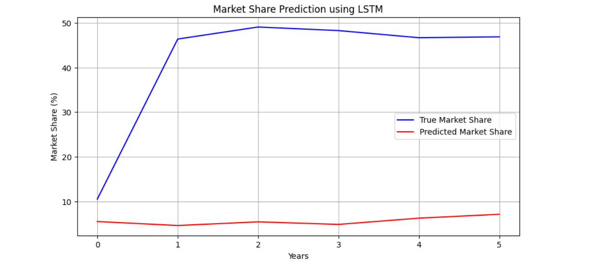

# Predictive Analysis using LSTM

This project focuses on predicting market share trends using LSTM (Long Short-Term Memory) neural networks and time-series analysis techniques.

## Features
- Data preprocessing and normalization
- Time-series forecasting using LSTM
- Deep learning model training
- Market share prediction visualization
- TensorFlow and Keras implementation

## Technologies Used
- Python
- TensorFlow
- Keras
- Pandas
- NumPy
- Matplotlib
- Scikit-learn

## Project Screenshots

### Dataset Preview

### Model Training

### Prediction Graph

## Repository Link
[Click Here to View Project](https://github.com/swarnika13/Predictive-Analysis)
